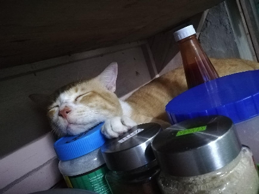
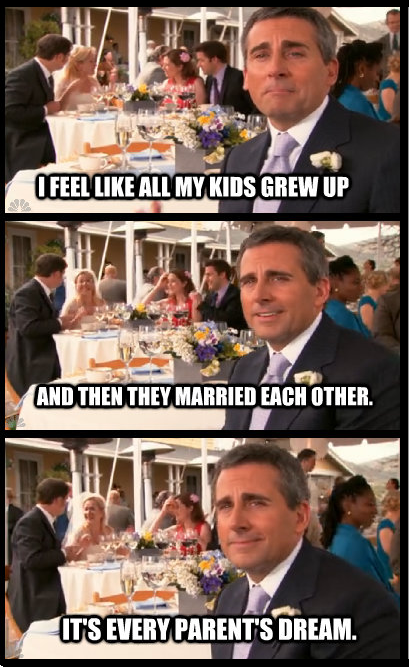

> Tangerine furs of simplicity

> Reflection of such laziness

> But pure of such sweetness

> Sad to say you can we no longer see

---

# Ponkan...

Ponkan was our first feline pet.

We had a German Shepherd dog before when I was a lad, but after a terrible incident we were forced to give Scooby away.

It took a very long time to wield to will, want, and have another pet, for my mother at least.

The recovery time was about seven years I think. Well, having a feline pet as the first step is a positive one.

Ponkan was a simple cat, white and orange in colour, always sleeping and kind of a snob since he only interacts with us when he is hungry. After filling up his stomach, he would go to high and obscure places just to sleep for a long time.

Every early morning, he would fit his head in the jalousie and relentlessly meows to wake us up, because he wants to eat.

He was really adorable and cute. I often see myself in that cat in terms of laziness.

After a year or so of having Ponkan, my sister and I got this Golden Retriever puppy we named Sachi, he is really adorable and cute as well.

I can still remember how Ponkan was lying there when Sachi charged to him and headbutted him then barked at him continuously. It was one of those moments I have witnessed that felt like I am in the shoe of Michael Scott.

(Not literally like that, just that how Michael Scott feels that he is the father of all the Dunder Mifflin employees)

Not too long after that, Sachi grew up to be a fine dog who wants nothing but to eat (just like her big brother). But as for Ponkan, well, he did not grow in size at all because he was already like in the final form for a feline, but he was really this type of mature cat who is full of patience and of very few words.

Sachi would always annoy Ponkan. I would often feel worried since Sachi tends to open her mouth and like bite Ponkan in the neck like a lion about to devour a gazelle. Ponkan would just sit there and pay no attention. There were those times where Sachi got into Ponkan's nerves, Ponkan would just slap her in the face and then Sachi cries. Heartwarming and funny moments between our pets.

If only everything would just stay the same for them.

This last week, Ponkan was gravely injured. I honestly do not know what happened to his front leg. He was limping. It was not new, it happened before, he recovered. But this time, it was really different. He does not want to eat anymore, he just wants to sleep. We thought it was normal for his recovery. But sometime later, he smelled gross like a flesh rotting. We were forced to move outside. He was just there. Still lying and not eating anything.

My mother tried to remedy his injury, but to no avail. I believed that it is normal and his recovery is just taking very long because of his old age.

But one time, I have decided to look at him. He was in the backyard. I opened and peeked over at the jalousie. About the moment I finally saw him, he was already looking at me. It felt like a lightning hit my heart. I went out to the backyard and looked at him.

I know. I know he is dying.

Just lying there and the smell just got worse. Those disrespectful ants already marching and fetching whatever food they gathered inside of Ponkan's leg. I know that nature is designed that way. Distasteful life cycle!

I stare at his eyes and somehow, I felt that he is saying farewell to me.

I could not take it. I just kept telling myself that he is going to be okay. I refuse to accept such facts even when everything presented itself to be evident.

The next morning, Friday, I have found him in a different place in the backyard, somehow I have found a glimpse of hope that he is still fine.

He was still breathing. I was afar when he looked at me.

That was the last time.

Later that afternoon, while in my classmate's house. My sister told me the inevitable news.

Our sweet Ponkan gave up his last breath.
