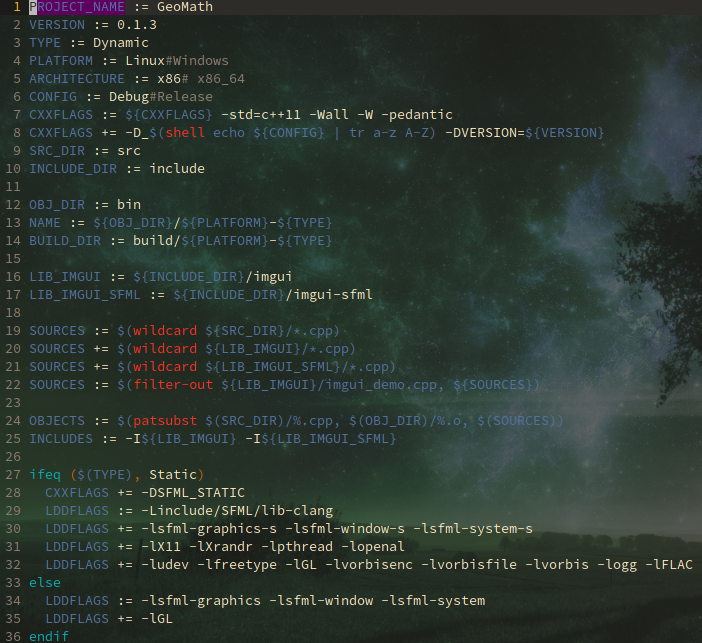
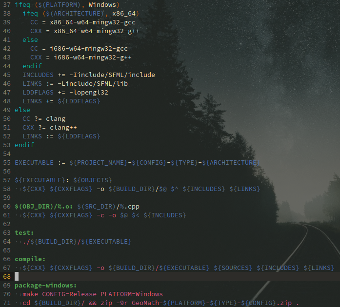
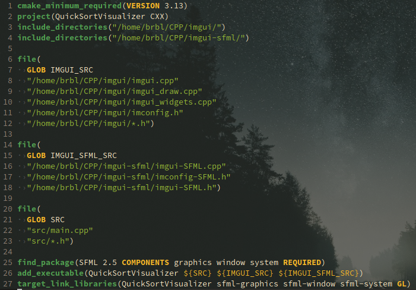
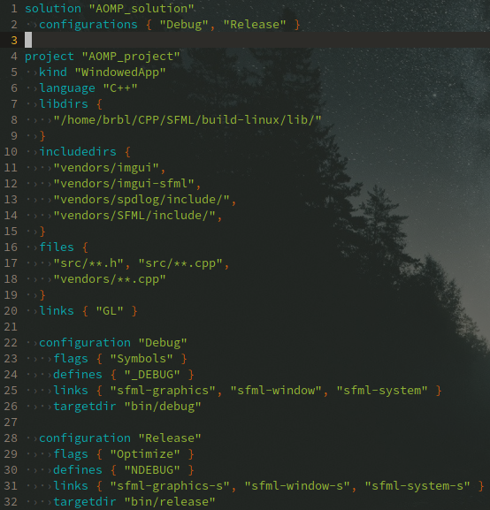

# C/C++ !

---

This past week has been a solid hell for me. A lot of things has to be done:

---

* Data Structure:
	* Grading System Program (Terminal)
	* QuickSort algrothm (Report and Demo)
* Rizal Mid-term exam (a field I always suck at)
* Biotechnology Mid-term exam (somehow not my forte)
* Database Software (Social Network)

---

All withing a span of a week.

That is when I dove deeper with C/C++.

I had a lots of experience in using and making an application with C++ for the [Geo::Math](https://github.com/flamendless/GeoMath) project for last semester's geometry subject. And I have to say that it is not that easy for someone like me who is very used to using Lua.

Thing is, it is not necessary to make a visualization program for the QuickSort report, we just have to make a terminal program that will demonstrate that sorting algorithm, but I always go the extra mile and make everything way more difficult for me.

So aside from Makefile, SFML, spdlog, and DearImGui, I have had to overclock my brain to figure out a way on how to make a visualization program out of the recursive and non-iterative sorting algorithm. Good thing I have found that out although it was very late and past the intended and alloted time. Still, it was fun doing that!

On the run, I have added the following to my C/C++ knowledge:

---

* Namespaces
* Macros
* Proper usage of & and *
* Using the **const** keyword in function parameters
* Usage of **struct** (I was used to using class)
* Some Standard Library stuff like **chrono**, **string manipulation**, **printf**, and more.
* More SFML stuff
* [spdlog](https://github.com/gabime/spdlog)
* Properly use (for the very first time) an C/C++ IDE called [Code::Blocks](http://www.codeblocks.org/)

---

### Thoughts about using an IDE

An IDE is really cool and helpful for developers using a **static-typed language** like C/C++, since it can help with:

---

* Refactoring/Renaming symbols (variables, class names, filenames, etc etc)
* Debugging
* Code completion
* Goto file, declaration, and definition.

---

Such could also be done in vim with the help of **lsp** or **language server protocol** For my setup, I onced used **YouCompleteMe** but that proves to be slowing my laptop especially when I have tried including a **gtk** file (my finding is that the background process necessary for code completion and code linting is searching through all the gtk files, which is huge). So I have moved to using **clangd** and **vim-lsp** with **vim-async**

I am not a fan of IDE ever since I learned the vim lifestyle! Suffice to say, I have to use one when I was using a friend's Windows laptop to build the QuickSort Visualization project. Setting up the search directories, include paths, etc etc is pretty inconvenient for me. I prefer to see a single file with all the necessary stuff there for building. At least, I have managed to make an executable for the project using the IDE.

---

I am at the point where I am blindly confident about my C/C++ skills that I want to branch out into making a game using pure C/C++. I am even tempted to write my own game framework using SFML and DearImGui.

> P.S. I have tried to make one using the löve framework, nothing is left to say but that all were scrapped because I have an OCD for code structure and stuff (hard to explain!)

But, I always find it hard to cross-compile the program for Windows using mingw in Linux. I have done this before with Geo::Math, and yet the I can't redo it for this one even with just tweaking the previous project's Makefile.

---

# PROJECT MANAGEMENT

Over another week that passed, I have come up with better knowledge about C/C++ project management.

Instead of putting all dependencies/libraries in a dedicated directory in my filesystem, then having my build system point to that directory, I have decided that it is better and easier project-wise to only put needed cpp and header files, along with the **LICENSE** (very important!) file, in a folder called **vendors** in my project directory.

So instead of:

```Makefile
# PROJECT A, B, C, ...
IMGUI := "/home/user/CPP/imgui/"
IMGUI_SFML := "/home/user/CPP/imgui-sfml/"
SPDLOG := "/home/user/CPP/spdlog/"
```

---

It is better to do:

```Makefile
# PROJECT A
IMGUI := "vendors/imgui/"
IMGUI_SFML := "vendors/imgui-sfml/"
SPDLOG := "vendors/CPP/spdlog/"

# PROJECT B
IMGUI := "vendors/imgui/"
IMGUI_SFML := "vendors/imgui-sfml/"
SPDLOG := "vendors/CPP/spdlog/"

# ... and so on
```

---

This way, I could modify a file without worrying about other projects.

Now, why on earth did I just do this very reasonable and basic management when I have been doing the same for every lua and löve projects before? I am not entirely sure. I think the fact that I do not intend to modify any code in any C/C++ third-party library is the reason, again, I do not know.

Oh wait, I know, I do not want to clone **SFML**, **DearImGui**, **ImGui-SFML**, and **spdlog** as submodules for every project since they are huge! I may just copy from the already cloned submodules and then just paste them per project, but believe me, copying and pasting a large git project takes long because of thousands of files inside the `.git` directory.

I guess those reasons are already enough and valid?

---

## From Makefile to CMake to Premake (genie)

I was using **Makefile** as my project's build system, but over many projects I saw its downsides and complications so I have looked for other build systems.

I thought of Meson, but I really haven't tried it.
I was eager to use premake5, but according to its wiki, it does not yet support generation for gmake.

In the SFML Discord server, I have learned from veterans there about CMake, I was a bit skeptic at first because personally I dislike CMake's syntax, but after with lesser lines of codes and successfully compiling and building my project which previously use Makefile I switched to CMake.

I was contented with CMake, also, with a single command, it can produce a **compile_commands.json** file for my project which is necessary for my vim setup that uses the **clangd** and **vim-lsp**

Then, the next day, a fellow person over at the Löve Discord server introduced me to genie, which is a premake4 fork but better! So after a few minutes of making it work, I am in love with it! It uses lua syntax which I am very familiar at, I even say that it is my personal favourite and my mastered language.

But, there is no way to make the needed **compile_commands.json** file through **genie**. Good thing there is this tool called [bear](https://github.com/rizsotto/Bear)! That bear is a life saver! I can just do: `bear make` and it will generate the **compile_commands.json** file!

Okay, for better comparisons, here is a **Makefile** file:

---



Then here is a **CMakeLists.txt** file:



Finally, here is a **premake4.lua** file:



---

Oh by the way, ofcourse if you want to check out the projects:

* [Grading System](https://github.com/flamendless/CPP-Project-StudentRecord)
* [QuickSort Visualization](https://github.com/flamendless/CPP-Project-Quicksort-Visualization)
* [Geo::Math](https://github.com/flamendless/GeoMath)

**Journary** and the **SFML Game** are still not open-source, I will share it to public after the semester.
