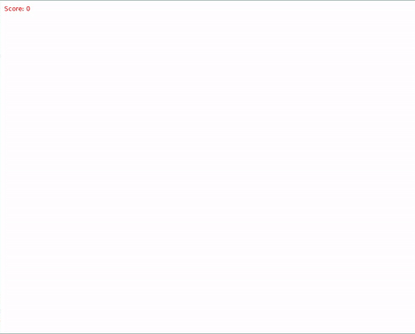

> WELCOME TO THE 4th INSTALLMENT OF ECS VS. OOP WEEKLY SERIES!

Before proceeding, if you have not read the [previous post](https://flamendless.github.io/ecs-vs-oop/)
and [previous part](https://flamendless.github.io/oop-tutorial-3/),
please check those first, this post will wait for you. You will
need the information and guide provided in the previous posts
for this one.

Done? Good! You may now resume your quest!

---

# UPDATES

Source code is now available [here](https://github.com/flamendless/ECSvsOOPTutorial)

---

# DISCLAIMER

This post will not try to teach Lua coding or any programming logic. This is to focus
primarily in OOP design and pattern.

If you want to learn basic programming and game development, let me know. I will make
an in-depth guide about it for beginners if requested.

---

# INTRODUCTION

Last time I promised for a media (image/video) to show the progress of what we are
making right? Well of course I do not disappoint! So here you go:



Looks good, doesn't it?

Okay so for now I want to make this post short as well due to time constraints. So
let us implement game states!

---

# IMPLEMENTING GAME STATES/SCENES

> What is a game state?

To put it simply, it is like a `container` for the different states possible in our game.
The whole game should be separated according to its `state` which as much as possible
should be in their own, no dependency with other state.

States can also be thought of as `screens`. Some engines/frameworks use that. Now that
I remember, Godot use `scene`, wait no, it kinda is, but at the same time even for the
concept of `object` they use the term `scene`. I digress.

We will use `screen` and `state` interchangably okay?

Here is a list of the states we will need:
* Title screen
	* Play - go to `Game screen`
	* Quit - exit the game
* Game screen
	* Playing
	* Paused
		* Back - go to `game screen`
		* Quit - exit the game
* Game over screen
	* Retry - go to `Game screen`
	* Back - go to `Title screen`

The basic thing we need of the screen base class are the following:
* ID - passed in constructor
* Events - update, draw, etc. Basically all the events from the `love` API that we will use

So we will need a base class for the screens/states

Make a new file named `scene.lua` in the `classes/base/` and put the following:
```lua
local Class = require("modules.classic")
local Scene = Class:extend()

function Scene:new(id, manager)
	self.id = id
	self.manager = manager
	self.is_active = false
end

function Scene:set_active(bool)
	self.is_active = bool
end

function Scene:get_active() return self.is_active end

return Scene
```

Quite simple right? But why do we have that `is_active` flag? Well, it is
for allowing us to have multiple screens at the same time. This is needed
in the case for making the `game screen` shown even when the `pause screen` is shown on top of it.

The `manager` field will be the gamestate manager we will implement next post. There are multiple ways to do this, but we will go for this approach as to avoid overcomplications with dependencies and whatnot.

Next we will implement the subclasses.

For `classes/title_screen.lua`:
```lua
local Scene = require("classes.base.scene")
local TitleScreen = Scene:extend()

local title = "Shape Clicker"
local font
local window_width, window_height
local text_width, text_height

function TitleScreen:new(manager)
	TitleScreen.super.new(self, "title_screen", manager)

	font = love.graphics.newFont(32)
	window_width, window_height = love.graphics.getDimensions()
	text_width = font:getWidth(title)
	text_height = font:getHeight(title)
end

function TitleScreen:draw()
	love.graphics.setColor(1, 0, 0, 1)
	love.graphics.setFont(font)
	love.graphics.print(title,
		window_width/2, window_height/2,
		0, 1, 1,
		text_width/2, text_height/2)
end

function TitleScreen:keypressed(key)
	if key == "enter" or key == "space" then
		self.manager:switch("game_screen")
	elseif key == "escape" then
		love.event.quit()
	end
end

return TitleScreen
```

For `classes/game_screen.lua`:
```lua
local Scene = require("classes.base.scene")
local GameScreen = Scene:extend()

function GameScreen:new(manager)
	GameScreen.super.new(self, "game_screen", manager)
end

function GameScreen:keypressed(key)
	local pause_screen = self.manager:get("pause_screen")

	if key == "escape" then
		pause_screen:set_active(not pause_screen:get_active())
	end
end

return GameScreen
```

For `classes/pause_screen.lua`:
```lua
local Scene = require("classes.base.scene")
local PauseScreen = Scene:extend()

function PauseScreen:new(manager)
	PauseScreen.super.new(self, "pause_screen", manager)
end

function PauseScreen:keypressed(key)
	local game_screen = self.manager:get("game_screen")

	if key == "return" or key == "space" then
		self:set_active(false)
		game_screen:set_active(true)
	elseif key == "escape" then
		self:set_active(false)
		self.manager:switch("title_screen")
	end
end

return PauseScreen
```

For `classes/gameover_screen.lua`:
```lua
local Scene = require("classes.base.scene")
local GameOverScreen = Scene:extend()

function GameOverScreen:new(manager)
	GameOverScreen.super.new(self, "game_screen", manager)
end

function GameOverScreen:keypressed(key)
	if key == "r" then
		self.manager:switch("game_screen")
	elseif key == "escape" then
		self.manager:switch("title_screen")
	end
end

return GameOverScreen
```

Phew, that was a lot! But if you can notice, there is a lot of issues
with it.

First, when there are multiple screens active at the same time,
doing a keypress will result in conflicting logic as multiple screens
will capture that event. 

Second, there is nothing yet in any state. We will move the content of
our existing game logic which is in `main.lua` and move those to their
respective scenes.

We will fix those when we finally make our manager.

---

This is for now! Sorry if the posts are falling short.
Time is kinda tight right now as well as some personal things going on.

---

# Next Week's Post:

For the next post, we will continue to:
* implement Gamestate/screen manager
* implement the UI classes and subclasses

---

Stay tuned via RSS or follow me on
<a href="https://twitter.com/{{site.author.twitter}}">Twitter</a>
