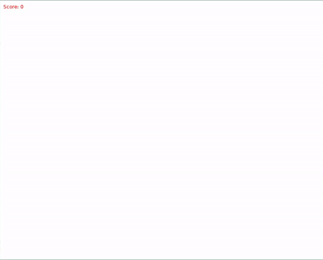

> WELCOME TO THE 4th INSTALLMENT OF ECS VS. OOP WEEKLY SERIES!

Before proceeding, if you have not read the [previous post](https://flamendless.github.io/ecs-vs-oop/)
and [previous part](https://flamendless.github.io/oop-tutorial-4/),
please check those first, this post will wait for you. You will
need the information and guide provided in the previous posts
for this one.

Done? Good! You may now resume your quest!

---

# UPDATES

Source code is now available [here](https://github.com/flamendless/ECSvsOOPTutorial)

---

# DISCLAIMER

This post will not try to teach Lua coding or any programming logic. This is to focus
primarily in OOP design and pattern.

If you want to learn basic programming and game development, let me know. I will make
an in-depth guide about it for beginners if requested.

---

# INTRODUCTION

Last time we only made additions in the backend, so no changes in the visual/front end.
Still, here is what we have so far:



---

Last time, we made a `scene` base class and other gamestates/screens subclasses. I know,
the terms `scene`, `screen`, `state` can be confusing, indeed they are, but for me, and
especially with this tutorial, they all refer to the same thing, well at least the usage
that is.

If you want to refactor the naming convention to be consistent, let me know and I shall
do that.

But before we proceed, let us first go and add the following to the
`classes/base/scene.lua`:
```lua
function Scene:update(dt) end
function Scene:draw() end
function Scene:mousepressed(mx, my, mb) end
function Scene:keypressed(key) end
function Scene:get_id() return self.id end
```
They will kind of act like `virtual` methods.

There is a lot of thing we need to change with `classes/title_screen.lua`,
so I suggest to completely erase every content of what we already have and paste
the following instead:
```lua
local Scene = require("classes.base.scene")
local TitleScreen = Scene:extend()

local title = "Shape Clicker"
local str_play = "Press enter or space to play"
local str_quit = "Press escape to quit"
local font, font2
local window_width, window_height

function TitleScreen:new(manager)
	TitleScreen.super.new(self, "title_screen", manager)

	font = love.graphics.newFont(64)
	font2 = love.graphics.newFont(18)
	window_width, window_height = love.graphics.getDimensions()

	return self
end

function TitleScreen:draw()
	love.graphics.setColor(1, 0, 0, 1)
	love.graphics.setFont(font)

	love.graphics.print(title,
		window_width/2, window_height/2 - 32,
		0, 1, 1,
		font:getWidth(title)/2,
		font:getHeight(title)/2)

	love.graphics.setFont(font2)
	love.graphics.print(str_play,
		window_width/2, window_height/2 + 64,
		0, 1, 1,
		font2:getWidth(str_play)/2,
		font2:getHeight(str_play)/2)

	love.graphics.print(str_quit,
		window_width/2, window_height/2 + 96,
		0, 1, 1,
		font2:getWidth(str_quit)/2,
		font2:getHeight(str_quit)/2)
end

function TitleScreen:keypressed(key)
	if key == "enter" or key == "space" then
		local GameScreen = require("classes.game_screen")
		self.manager.switch(GameScreen)
	elseif key == "escape" then
		love.event.quit()
	end
end

return TitleScreen
```

Also, for all the subclasses of the scene, namely `game_screen.lua`. `gameover_screen.lua`,
`pause_screen.lua`, `title_screen.lua`, make the following additions:
```lua
function XXXXXX:new(manager)
	--before the `end` keyword
	return self --add this
end
```

---

# IMPLEMENTING GAMESTATE MANAGER

Now, to test the gamestates we have done, let us make a gamestate manager module.
This manager module will be a singleton, meaning, we will not create any instance of
it, this is kind of like `static` in C/C++ concepts.

Why do this? Because we do not need to make any instance of it. We only want one to use
this as general as possible.

Now, there is a lot of gamestate manager library out there which are far better than what
I am going to provide, what I am going to make is hacky as just fit for this tutorial.

My aim is not to teach the concept of gamestate management or how to properly do it, in my
personal projects I have one that is complex and has a lot of features suitable for the kind
of game I am making, abstracting it away from the project will be a hassle for now so for now,
bear with this ugly gamestate manager I am going to show.

Create a file in the root of the project (not inside the `classes/` folder)
named `gamestate_manager.lua` and write the following:
```lua
local GamestateManager = {}

local states = {}
local current_state
local previous_state

function GamestateManager.init(state)
	current_state = state:new(GamestateManager)
	current_state:set_active(true)
	table.insert(states, current_state)
end

function GamestateManager.switch(next_state)
	previous_state = current_state
	current_state = next_state:new(GamestateManager)
	current_state:set_active(true)
	table.insert(states, current_state, 1)

	print("Switched from " .. previous_state:get_id() .. " to " .. current_state:get_id())
end

function GamestateManager.update(dt)
	for _, state in ipairs(states) do
		if state:get_active() then
			state:update(dt)
		end
	end
end

function GamestateManager.draw()
	for _, state in ipairs(states) do
		if state:get_active() then
			state:draw()
		end
	end
end

function GamestateManager.mousepressed(mx, my, mb)
	for _, state in ipairs(states) do
		if state:get_active() then
			state:mousepressed(mx, my, mb)
		end
	end
end

function GamestateManager.keypressed(key)
	for _, state in ipairs(states) do
		if state:get_active() then
			state:keypressed(key)
		end
	end
end

return GamestateManager
```

---

# TESTING

To test that that manager is indeed working, rename the `main.lua` file into whatever you
like, in my case I renamed it to `main_temp.lua`. After that, create another file called
`main.lua` and put the following:
```lua
local GamestateManager = require("gamestate_manager")

function love.load()
	love.graphics.setBackgroundColor(1, 1, 1, 0.8)

	local title_screen = require("classes.title_screen")
	GamestateManager.init(title_screen)
end

function love.update(dt)
	GamestateManager.update(dt)
end

function love.draw()
	GamestateManager.draw()
end

function love.mousepressed(mx, my, mb)
	GamestateManager.mousepressed(mx, my, mb)
end

function love.keypressed(key)
	GamestateManager.keypressed(key)
end
```

And then run the game, you will only see the title of our game in the center of the screen.
Sweet!

Now press `enter` or `space` and voila! We just switched to a new state!
(see terminal/console for the printed output)

---

This is it for now! Again, pardon for the short post. Time and schedule is kinda
tricky right now.

---

# Next Week's Post:

For the next post, we will continue to:
* implement more states
* implement the UI classes and subclasses

---

Stay tuned via RSS or follow me on
<a href="https://twitter.com/{{site.author.twitter}}">Twitter</a>
