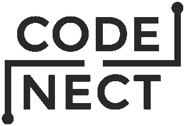

# What is CodeNect?

CodeNect is a visual programming software aimed for beginners at programming.
This is developed for my thesis. The source code is
[available](https://github.com/flamendless/CodeNect-VPS)

Windows pre-built binaries are available over at
[itchio](https://flamendless.itch.io/codenect)

# Choosing the Technology and Tools

Initially during the planning, way before the development has started, I was really
looking forward to finally using the [Haxe](https://haxe.org) programming language
as I have been keeping an eye on it for a very long time but with no solid reason yet
to use it. So then after deciding to try out Haxe, I have looked around for the tools
that I could use to further ease the development, especially for the GUI and
Nodes libraries as I do not want to spend a lot of unneeded time writing those myself.
Then I found the [Kha](https://kha.tech) and the [zui](https://github.com/armory3d/zui)
libraries.

---

## Experiences with Haxe

So with the preparations completed. I begun the development and here are the experiences
with Haxe:

(note that most of the pointers are my opinion and can be proven wrong with
more time using it as I am a beginner at Haxe)

1. Haxe in itself is amazing and powerful and that I think is also a problem as
   the docs are kind of lacking in my option. One thing that led to my demise
   is that since I quickly learned Java and C# due to my knowledge with
   static-typed languages and similar, I was complacent that Haxe would be just a walk
   in the park, for the basics of course, not so in-depth. This became a problem
   when I started to deal with dynamic types especially when getting data from JSON.
2. Since Haxe transpiles to other languages, it became a problem for me dealing
   with the filesystem. I really want my project to be native and fast so
   I aimed at using the C++ target, but a fairly simple "Hello World" project
   takes a very long time to compile. People over at the discord server said
   that that should not be the case, but I do not know why that is the case in
   my machine.
3. Most Haxe users in the discord server recommended using the JS/Web target
   for development but the problem with going that route is the filesystem API, you
   know that CORS thingy. I could write some preprocessor with Haxe to use a different
   method for filesystem depending on the target but that defeats the goal as stated in
   the specs to use native.
4. The zui library is indeed a very powerful UI and Node library as it is used
   in the Armory software. However, it lacks documentation/wiki, so I will have to
   check the source for information as well as rely on the sample/getting started code
   in the README of the repository. That is doable, but time consuming.

Suffice to say, that my first endeavor with Haxe is not a good one, but I am still
interested in using it perhaps next time for game development. For now, I have to
choose another stack for the software.

---

## The Other Candidates

### Lua

So why not Lua? I could really use Lua + LOVE framework for the project and for the
following reasons:

* With Lua + LOVE, I have a lot of knowledge and experience with it
* The development time will be easier as there is no need for compilation
* I LOVE Lua (pun intended)
* It is already cross platform

But the main takeaway is that, I felt that I do not have time to write my own Nodes
system with it. Also, I really do not know how to even start writing that complicated
system. I know, kind of a silly excuse, but that is that. Oh, GUI is also not mature
with LOVE (atleast with the libraries I know that exist).

### JavaScript

I also found out many Nodes library that I can use with JS, but then again,
I want to not use the browser/web technology as my laptop is old and has RAM
limitations (3gb, yeah). Also the libraries I have found seem to have a lot of issues
and are not actively maintained anymore?

### Java

NO WAY IN EARTH I WOULD SPEND MONTHS WRITING IN JAVA

---

# Why I Chose C++

Ah, C++, the most complicated programming language I have used in my life. It
is very powerful but complicated. Unlike my defacto favorite which is Lua, even
if I spend years and years using it, I will never be able to completely master
it or wrap my head around it fully like with Lua (I mean, is there someone who
knows C++ all throughout?).

So back again to C++, why C++?

Well, there is a lot of Nodes library for C++. There are atleast 3 different ImNodes
named library. Also, I have a lot of experience with using DearImGui as GUI for software
development (See my previous project [Geo::Math](https://brbl.itch.io/geomath)).
(Then again, while I am writing this post I realized that there are ImGui bindings for
Lua and LOVE, so perhaps I could make ImNodes work for LOVE using cimgui? Oh well, no
time for regret)

I think that the main reason that drove me to finally using C++ is that there is a part
of me that really wants to learn more about C++. I am hopelessly a fan of it though
I have a lot of complaints with it such as:

* Please, do not use `auto` in sample code for you C++ library makers
* I want to learn C++ and as much as possible know by heart what those `auto`
  are equivalent to
* Ugh, templates, really do not want to deal with those. You will see in my
  project that I have not used templating/generics

---

## Experiences with C++

### The Language Itself

There is no need to mention that most of the development time using C++ has been
debugging why it segfaults and why are strings corrupted or missing. We all know
that I am bound to experience problems with pointers and memory address.

If you will check the source code, you will frown upon me for not using any
smart pointers.  I have my reasons why I wrote the entire software using raw
pointers and such but in summary, I want to learn C++, and that includes almost
manual memory management. Perhaps next time, I will resort to using smart pointers
and `auto` to make life easier.

Also, when debugging, I always did the `bunch of print statements` rather than
using a debugger, but I think there was this one time that I used `lldb` to get a lead
on why it segfaults after hours of `print` every other line of code. The cause of
the segfault? Haha, you know it, referencing a null pointer.

Another thing that I am worried that would get a lot of criticism in the source
code is the fact that I just wrote almost all of the `singleton` (I maybe
technically wrong with my definition of singleton) structs as `static`.  I know
that there is a better way on how to make a struct `singleton` but during the
development I just stuck with `static` methods and properties to make them like
`global`

### Build System
During the early development of CodeNect, I have used the [Xmake](https://xmake.io/)
build system. I mean, I know Lua so this would be a better option that using `Makefile`
or something, and as much as possible, no to `CMake`.

But Xmake has little number of users and so guides and references are sparse online.
Their documentation is complete but there are things of course that I do not understand
quite easily from there so Stackoverflow is a nice place to use as reference.

So after fiddling with Xmake, I have tried using Meson, Genie, and Premake but to no
avail as I had many issues with those that I do not remember right now. So a friend over
at discord helped me convert my Xmake build system to CMake. To be honest I still do
not understand CMake that much to the point that I can easily add or modify the CMake
script but at least it works across Linux and Windows.

### Linking/Transpiling

You know what is also terrifying aside from compiling a C++ project? Linking.
I spent a lot of debugging and figuring out why I get linking error especially
with the part that has to do with using the `TinyC Compiler` or
[libtcc](https://bellard.org/tcc/). LibTCC is a very useful tool that I utilized
for CodeNect so that my software will not rely on installing or requiring compilers
for the machine it is being ran. But yeah, linking it as well as making sure that
the necessary files can be found along the `.exe` is present. This would not really
be a problem if there is an updated or maintained documentation, but sadly, even the
homepage of LibTCC lacks the documentation for users as the docs there are more
oriented towards developers (that will modify the libtcc source). Anyway, with the
help of other websites and people over at discord, I have managed to make it work
for both Linux and Windows in a very portable manner.

### User Interface

I used DearImGui for all the GUI in the software. They say that DearImGui is
more suited as GUI for debugging/development and not for production, but for me
DearImGui exceeds my GUI needs. Also, writing in Immediate Mode is way easier
than making a lot of callbacks for events. I like the declarativeness that IM
provides.

#### What I Love the Most About Immediate UI

Using the immediate mode paradigm, it made the process for managing the logic
and behavior behind the Nodes system much easier. Instead of thinking how the
logic will flow and process every event like `on connection`, `on delete
connection`, `on change connection`, and so on. I just need to think it
happening per frame. I just needed to manage the logic per kind of node.
I learned a lot of things writing the `NodeLogic` system.

> I will write/explain the in-depth of Codenect in future blog post

Of course with doing that approach, I have to make sure that pointers and references
are handled correctly, but once I got the general idea and like pattern for writing
each logic for the kind of node, it becomes very easy and in rhythm.

One of the hardest for me to evaluate was checking for cyclic nodes. I had to
write a lot of recursive functions for that, but hey, at least I learned more
about recursions.  Also, recursion is way easier to write in static-typed
languages compared to dynamic ones.

---

As for the other libraries/tools I have used, I want to give my gratitude for the
developers for writing open-source and free libraries.

Here is a list of those that I have used:
* [better-enums](https://github.com/aantron/better-enums)
* [ImGuiColorTextEdit](https://github.com/BalazsJako/ImGuiColorTextEdit)
* [fmt](https://github.com/fmtlib/fmt)
* [IconFontCppHeaders](https://github.com/juliettef/IconFontCppHeaders)
* [DearImGui](https://github.com/ocornut/imgui)
* [Doctest](https://github.com/onqtam/doctest)
* [GLFW](https://www.glfw.org/)
* [ImGuiMarkdown](https://github.com/juliettef/imgui_markdown)
* [ImNodes](https://github.com/rokups/ImNodes)
* [nativefiledialog](https://github.com/mlabbe/nativefiledialog/)
* [plog](https://github.com/SergiusTheBest/plog)
* [PPK_ASSERT](https://github.com/gpakosz/PPK_ASSERT)
* [simpleini](https://github.com/brofield/simpleini/)
* [stb_image](https://github.com/nothings/stb/blob/master/stb_image.h)
* [TinyC Compiler](https://bellard.org/tcc)
* [Tweeny](https://github.com/mobius3/tweeny)
* [CppVerbalExpressions](https://github.com/VerbalExpressions/CppVerbalExpressions/)
