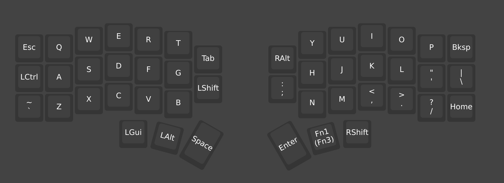

They say that the progression to being a 10x developer is this:

- From Windows/Mac to Ubuntu Linux
- From Ubuntu Linux to Arch Linux (I use Arch btw)
- From Arch Linux to Nix or Void or Gentoo Linux
- From any laptop to Thinkpad
- From any IDE to Vim/Neovim or Emacs
- From any GUI to Terminal/CLI apps
- From any basic keyboard to an ergonomic keyboard
- From ergonomic keyboard to ergonomic mechanical keyboard
- From ergonomic mechanical keyboard to ergonomic mechanical split keyboard
- From ergonomic mechanical split keyboard to custom ergonomic mechanical split keyboard

The list goes on... For the sake of simplicity and productivity, let us move on.

As for my progression, I have skipped some steps. I am now in the keyboard phase.

I was greatly influenced by the great The Primeagen, who will make an hour-long video reacting to this blog post.

I started my keyboard side quest with a full mechanical keyboard with RGB switches (yeah, beat that, you cherry, brown, blue, and red folks).

But mechanical keyboards became too "normie" for me, so I went a step beyond with a split keyboard. I was really aiming for modern Kinesis but it is too expensive.
Fortunately, I was able to purchase a second-hand Kinesis Freestyle 2 with the tenting accessories but sadly no palm/wrist pad support.

I rocked that keyboard along with my subpar typing speed + Vim. I was very content with it for life, or at least the life of Kinesis Freestyle 2.

Then, while watching a DSM video about their keyboards, the phrase "...no one was able to use Prime's keyboard because it was so customized and personalized" struck me. I want something like that: the potential, the hardship, the developer aura, and the productivity, nuff said.

I was already browsing the world of the Internet before the supposedly five-minute DSM ended. I saw the Glove, Moonlander, and so on. They're too expensive for me yet again. Also, this time I'm looking for something smaller and more portable because imagine bringing and using Kinesis in a public place...

Then I saw the Corne split keyboard. It was a relief. Not too expensive, very small, and split type. The only downside is the risk of buying it online from a Chinese seller. I do not want the kit variant wherein I have to do some soldering, wiring, and more. Hey, I am a software guy, alright, not a hardware guy. Good thing there is a pre-built variant.

Grateful for my lovely girlfriend who bought it and gifted it to me. Removing any guilt or anxiety that the package might arrive broken or with a defect.

---

Now here comes the first experience. Right out of the box, I was so excited. plugged it in, and voila, nothing. So I searched around, not knowing what to specifically query; for I do not know the exact model of this Corne keyboard. Then product details only specified "RGB/Vial/Version 4". Good thing I found this great and [awesome article](https://zellwk.com/blog/corne-keyboard-setup/)!

I was about to go the QMK route, but awesome shoutout and gratitude to the people who made Vial, a web-based tool for this stuff.

After carefully following it and trying [Vial](https://vial.rocks), only the left side worked. So I read more. I may have bricked the right half because I may have connected both with the TRS/TRSS cable after I plugged the USB cable. Rookie mistake!

I was in denial. I did not want to believe that the package was defective, so I tried connecting the right side to Vial; it worked. I was about to resort to having each half connected via USB. looks ugly, but at least nothing is wasted. The issue with that is the setup via Vial. Since it works individually, the fair assumption would be to suspect the cable that connects the two. So I bought another TRS cable. Didn't work. I opened each half and pretended to know a thing or two about the hardware inside. Nothing. I was about to give up until I saw in the article some phrase about not worrying about trying other firmware versions because if it does not work, we can always reflash.

So I tried the v4.1 version, much to my chagrin that the product details say (explicitly?) version 4. Flashed each side with v4.1, TRS cable first, prayed, USB cable next...

My eyes lit up as both halves greeted me with RGB lights.

Here is a picture of my mapping. I feel like it's going to be a very steep learning and adjustment period for me.

Oh, by the way, this post is the first I've written using this new keyboard. It	took me like thrice as long as with a keyboard I am more used to.

---

***Soli Deo Gloria***
